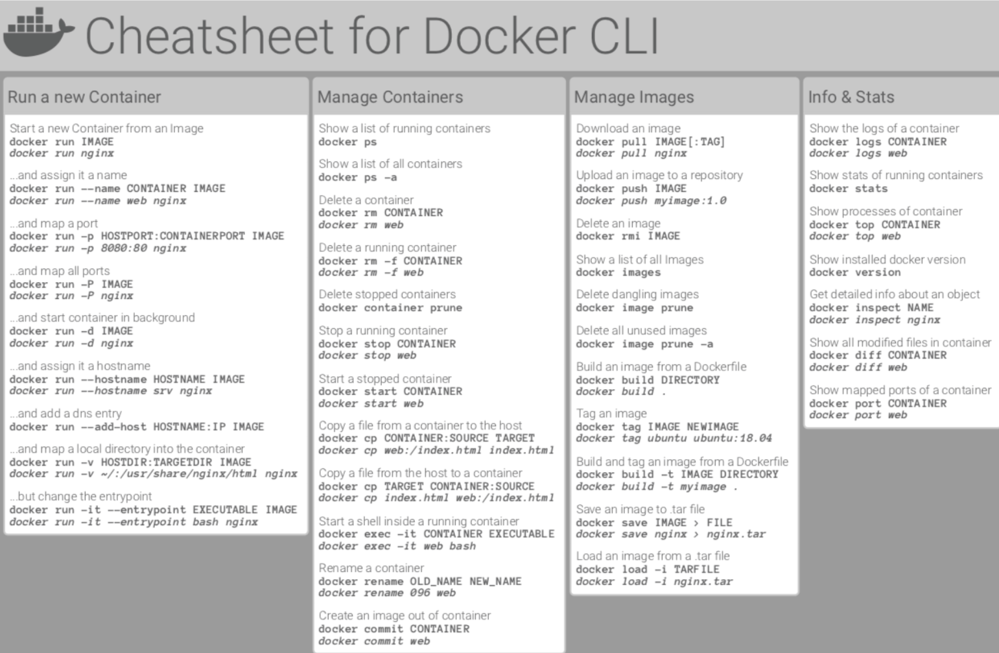

# Docker

An open platform for developing, shipping, and running applications. Docker enables you to separate your applications from your infrastructure so you can deliver software quickly. 

## Why we are using docker

- low impact on OS, work really fast
- can share, rebuild and distribute very easily (it should be easy to share a common development environment/setup with new people)
- we can have the exact same environment for development and production, this ensures that it works exactly as tested

## Glossary

### Containers
Containers are running instances of Images. When you create a container (via `docker run` ), a thin read-write layer is added on top of the Image. 

Multiple Containers can therefore be started based on one and the same Image. All Containers run in isolation, i.e. they don't share any application state or written data. You need to create and start a Container to start the application which is inside of a Container. So it's containers which are in the end executed - both in development and production.

### Images

- **images will be the templates, the blueprints for containers, it's actually the image, which will contain the code and the required tools to execute the code, and then it's the container that then runs and executes the code.**
- Images are either pre-built (e.g. official Images you find on DockerHub) or you build your own Images by defining a `Dockerfile`.
    - `Dockerfiles` contain **instructions** which are executed when an image is built ( `docker build .`)
- **Images are locked and finished once you built them**. **Everything in the images is read only then,** and you can't edit it from the outside by simply updating your code. The image doesn't care about the past. Once this copy operation is done, you can change your outside code however you want. You can even delete it and the image will not be affected. You need to rebuild to pick up external changes and basically copy all the updated code into the image. So therefore, what we need to do here is we need to run `docker build .` again to rebuild this image and therefore to build a new image in the end.

### Two types of external data storages

### Volumes - managed by docker

**Volumes are folders (and files) managed on your host machine which are connected to folders / files inside of a container.** There are two types of Volumes:

- Anonymous Volumes
    - created specifically for a single container
    - survives when container shutdown/restart unless it is removed (`—rm` is used)
    - cannot share across containers
    - since it is anonymous. it cannot be reused
- Named Volumes:
    - we cannot create named volumes inside a docker file, not attached to any specific container
    - can share across containers
    - survive even we remove the container
    
    Since data is not just written in the container but also on your host machine, the data survives even if a container is removed (because the Named Volume isn't removed in that case). Hence you can use Named Volumes to persist container data (e.g. log files, uploaded files, database files etc).
    

### Bind Mounts - managed by you

The developer, set the path on the host machine that should be connected to some path inside of a Container.

The path in front of the : (i.e. the path on your host machine, to the folder that should be shared with the container) has to be an **absolute path** when using -v on the docker run command. 

Bind Mounts are very useful for sharing data with a Container which might change whilst the container is running - e.g. your source code that you want to share with the Container running your development environment.

Don't use Bind Mounts if you just want to persist data - Named Volumes should be used for that (exception: You want to be able to inspect the data written during development).

In general, Bind Mounts are a great tool during development - they're not meant to be used in production (since you're container should run isolated from it's host machine)

## Key Docker Commands

### Appendix
- [Find the images](https://hub.docker.com/search?q=)
- [Docker command cheatsheet](https://dockerlabs.collabnix.com/docker/cheatsheet/)